# Agent Development

In the Agent Development page, you can create, configure, and manage agents. Agents are the core feature of Nexent—they can understand your needs and perform corresponding tasks.

## 🔧 Create an Agent

On the Agent Management tab, click "Create Agent" to create a new blank agent. Click "Exit Create" to leave creation mode.
If you have an existing agent configuration, you can also import it:

1. Click "Import Agent"
2. In the file selection dialog, select the agent configuration file (JSON format)
3. Click "Open"; the system will validate the file format and content, and display the imported agent information

<div style="display: flex; justify-content: left;">
  
</div>

> ⚠️ **Note:** If you import an agent with a duplicate name, a prompt dialog will appear. You can choose:
> - **Import anyway**: Keep the duplicate name; the imported agent will be in an unavailable state and requires manual modification of the Agent name and variable name before it can be used
> - **Regenerate and import**: The system will call the LLM to rename the Agent, which will consume a certain amount of model tokens and may take longer

> 📌 **Important:** For agents created via import, if their tools include `knowledge_base_search` or other knowledge base search tools, these tools will only search **knowledge bases that the currently logged-in user is allowed to access in this environment**. The original knowledge base configuration in the exported agent will *not* be automatically inherited, so actual search results and answer quality may differ from what the original author observed.

<div style="display: flex; justify-content: left;">
  
</div>

## 👥 Configure Collaborative Agents/Tools

You can configure other collaborative agents for your created agent, as well as assign available tools to empower the agent to complete complex tasks.

### 🤝 Collaborative Agents

Collaborative agents help the current agent complete complex tasks. The sources of collaborative agents are divided into two categories:

- **Internal Agents**: Published agents on the platform
- **External A2A Agents**: Third-party agents discovered through the A2A protocol

1. Click the plus sign under the "Collaborative Agent" tab to open the selectable agent list
2. The agent list is divided into two tabs: "Internal Agent" and "External A2A Agent". You can choose based on your needs
3. Select the agent you want to add from the dropdown list
4. Multiple collaborative agents can be selected
5. Click × to remove an agent from the selection

<div style="display: flex; justify-content: left;">
  
</div>

#### 🌐 Add External A2A Agents

Nexent supports communication with third-party agents through the A2A protocol. You can discover external A2A agents in the following two ways:

##### Discover Agent via URL

If you know the Agent Card address of the target agent, you can use the URL discovery method:

<div style="display: flex; justify-content: left;">
  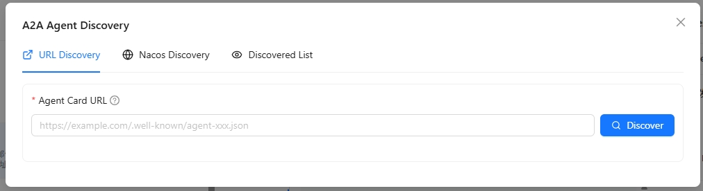
</div>

1. In the External A2A Agent list, click the "Add External Agent" button
2. Select the "URL Discovery" tab
3. Fill in the Agent Card URL address, for example: `https://example.com/.well-known/agent.json`
4. Click the "Discover" button; the system will automatically retrieve the agent's related information
5. After successful discovery, you can view the agent's name, description, capabilities and other information
6. Click "Add to List" to complete the addition

> 💡 **Tip**: The Agent Card is an Agent description file that complies with the A2A 1.0 specification, containing the agent's name, description, calling address, capabilities and other information.

##### Discover Agent via Nacos

If your agent is registered with the Nacos service discovery platform, you can use the Nacos discovery method:

<div style="display: flex; justify-content: left;">
  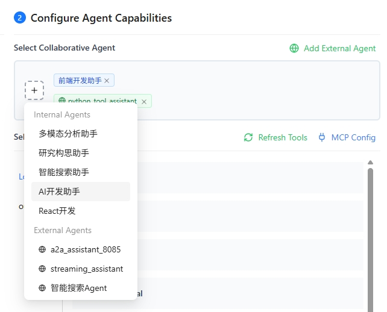
</div>

1. In the External A2A Agent list, click the "Add External Agent" button
2. Select the "Nacos Discovery" tab
3. For first-time use, you need to configure the Nacos connection information:
   - **Nacos Server Address**: Fill in the Nacos server address, such as `http://127.0.0.1:8848`
   - **Namespace ID**: Fill in the Nacos namespace ID (optional)
   - **Group Name**: Fill in the service group name, default is `DEFAULT_GROUP`
   - **Username/Password**: Fill in the Nacos access credentials (optional)
4. Click "Save Configuration" to save the Nacos connection information
5. Fill in the Agent service name to scan
6. Click the "Scan" button; the system will obtain matching Agent information from Nacos
7. The scan results will list all matching Agents. You can select the agents you need and add them to the list

> ⚠️ **Note**: Make sure the Nacos service is running properly and the target Agent is correctly registered with Nacos.

##### Manage Discovered External Agents

In the External A2A Agent list, you can view and manage all discovered external agents:

<div style="display: flex; justify-content: left;">
  
</div>

1. **View Agent Details**: Click on the agent card to view its complete information, including name, description, URL, capability list, etc.
2. **Test Agent**: Click the "Test" button to send a test message to the agent and verify if it is working properly
3. **Chat with Agent**: Click the "Chat" button to open a chat window and interact with the agent in real time
4. **Configure Calling Protocol**: Click the "Protocol Configuration" button to select the calling protocol for this agent:
   - **HTTP + JSON**: Use REST API style calls
   - **JSON-RPC**: Use JSON-RPC protocol calls
5. **Refresh Agent Information**: If the agent information changes, click the "Refresh" button to re-fetch the latest Agent Card
6. **Remove Agent**: Click the "Remove" button to delete the agent from the discovered list

> 💡 **Use Cases**:
> - Quickly integrate known third-party agent services through URL discovery
> - Batch integrate all agents from the same service registry through Nacos discovery
> - Configure protocols to meet the requirements of different agent service providers

### 🛠️ Select Agent Tools

Agents can use various tools to complete tasks, such as knowledge base search, file parsing, image parsing, email sending/receiving, file management, and other local tools. They can also integrate third-party MCP tools or custom tools.

1. On the "Select Tools" tab, click "Refresh Tools" to update the available tool list
2. Select the group containing the tool you want to add
3. View all available tools under the group; click ⚙️ to view tool details and configure parameters
4. Click the tool name to select/deselect it
   - If the tool has required parameters that are not configured, a popup will appear to guide you through parameter configuration
   - If all required parameters are already configured, the tool will be selected directly

<div style="display: flex; justify-content: left;">
  
</div>

> 💡 **Tips**：
> 1. Please select the `knowledge_base_search` tool to enable the knowledge base search function.
> 2. Please select the `analyze_text_file` tool to enable the parsing function for document and text files.
> 3. Please select the `analyze_image` tool to enable the parsing function for image files.
> 
> ⚠️ **Embedding Model Configuration**: When using the `knowledge_base_search` tool, ensure that the knowledge base has an embedding model configured. For existing knowledge bases, the system will prompt you to select an embedding model. Make sure to select **the same embedding model used when creating the knowledge base**. If the selected model differs from the one used during knowledge base creation, it may cause search failures or inaccurate results.
> 
> 📚 Want to learn about all the built-in local tools available in the system? Please refer to [Local Tools Overview](./local-tools/index.md).

### 🔌 Add MCP Tools

On the "Select Agent Tools" tab, click "MCP Config" to configure MCP servers in the popup and view configured servers.

You can add MCP services to Nexent in the following two ways:

**1️⃣ Add MCP Service via URL**

🔔 This method is suitable for independently deployed MCP services (supports SSE and Streamable HTTP protocols):

>1. In the **Add MCP Server** section at the top of the interface, fill in **Server name** and **Server URL**
>
>⚠️ **Note:** The server name must contain only English letters or digits; spaces, underscores, and other characters are not allowed.
>
>2. Click the **+ Add** button on the right to complete adding a single service

**2️⃣ Add Containerized MCP Service via JSON Configuration**

🔔 This method is suitable for containerized MCP services deployed via npx:

>1. In the **Add Containerized MCP Service** input box, fill in a JSON configuration that matches the example format:
>
>```json
>{
> "mcpServers": {
>   "service-name": {
>     "args": [
>       "mcp-package-name@version",
>       "additional-parameters"
>     ],
>     "command": "npx"
>   }
> }
>}
>```
>
>2. In the **Port** input box below, enter the port number corresponding to the containerized service
>3. Click the **+ Add** button on the right to complete adding the containerized service

<div style="display: flex; justify-content: left;">
  
</div>

Many third-party services such as [ModelScope](https://www.modelscope.cn/mcp) provide MCP services, which you can quickly integrate and use.
You can also develop your own MCP services and connect them to Nexent; see [MCP Tool Development](../backend/tools/mcp).

**3️⃣ Convert Stock API to MCP Service**

🔔 This method is suitable for quickly converting existing REST API endpoints into MCP tools without additional development, allowing agents to call existing API capabilities:

>1. In the MCP Config module, select **"API to MCP"** as the access type
>
>2. Fill in the API basic information in the input box below:
>   - **Service Name**: Display name for the MCP service
>   - **OpenAPI JSON**: OpenAPI 3.x specification in JSON format
>   - **Base Service URL**: Base address of the API service (supports http/https)
>
>3. Click the **+ Add** button in the lower right corner to complete the MCP service conversion

<div style="display: flex; justify-content: left;">
  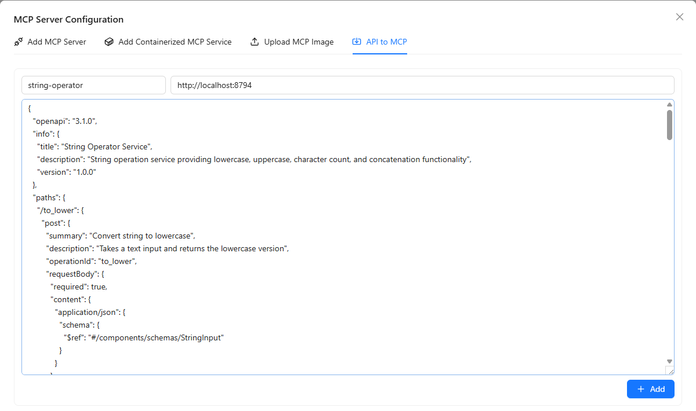
</div>

>4. After conversion, you can view all externally converted MCP tools in the **Outer APIs** tab

<div style="display: flex; justify-content: left;">
  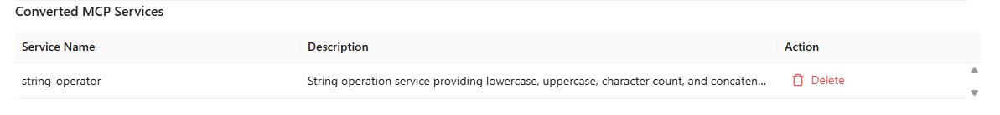
</div>

<div style="display: flex; justify-content: left;">
  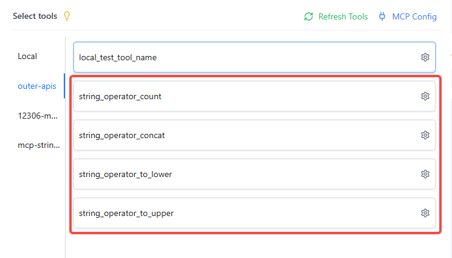
</div>

>💡 **Use Cases**:
>- Quickly integrate internal enterprise REST API endpoints
>- Convert third-party service HTTP APIs into MCP tools
>- Generate tools directly from OpenAPI specifications without writing MCP Server code


### ⚙️ Custom Tools

You can refer to the following guides to develop your own tools and integrate them into Nexent to enrich agent capabilities:

- [LangChain Tools Guide](../backend/tools/langchain)
- [MCP Tool Development](../backend/tools/mcp)
- [SDK Tool Documentation](../sdk/core/tools)

### 🧪 Tool Testing

Nexent provides a "Tool Testing" capability for all types of tools—whether they are built-in tools, externally integrated MCP tools, or custom-developed tools. If you are unsure about a tool's effectiveness when creating an agent, you can use the testing feature to verify that the tool works as expected.

1. Click the gear icon ⚙️ next to the tool to open the tool's detailed configuration popup
2. First, ensure that all required parameters (marked with red asterisks) are configured
3. Click the "Test Tool" button in the lower left corner of the popup
4. A new test panel will appear on the right side
5. Enter the tool's input parameters in the test panel. For example:
   - When testing the local knowledge base search tool `knowledge_base_search`, you need to enter:
     - The test `query`, such as "benefits of vitamin C"
     - The search `search_mode` (default is `hybrid`)
     - The target index list `index_names`, such as `["Medical", "Vitamin Encyclopedia"]`
      - If `index_names` is not entered, it will default to searching all knowledge bases selected on the knowledge base page
6. After entering the parameters, click "Execute Test" to start the test and view the test results below

<div style="display: flex; justify-content: left;">
  
</div>

## 📝 Describe Business Logic

### ✍️ Describe How the Agent Should Work

Based on the selected collaborative agents and tools, you can now describe in simple language how you expect this agent to work. Nexent will automatically generate the agent name, description, and prompts based on your configuration and description.

1. In the editor under "Describe how should this agent work", enter a brief description, such as "You are a professional knowledge Q&A assistant with local knowledge search and online search capabilities, synthesizing information to answer user questions"
2. Select a model (choose a smarter model when generating prompts to optimize response logic), click the "Generate Agent" button, and Nexent will generate detailed agent content for you, including basic information and prompts (role, usage requirements, examples)
3. You can edit and fine-tune the auto-generated content (including agent information and prompts) in the Agent Detail Content below

#### 📋 Agent Basic Information Configuration

In the basic information section, if you are not satisfied of the auto-generated content, you can configure the following fields by your own:

| Field | Description |
|-------|-------------|
| **Agent Name** | The display name shown in the interface and recognized by users. |
| **Agent Variable Name** | The internal identifier for the agent, used to reference it in code. Can only contain letters, numbers, and underscores, and must start with a letter or underscore. |
| **Author** | The creator of the agent. Defaults to the current logged-in user's email. |
| **User Group** | The user group the agent belongs to, used for permission management and organization. If empty, the agent has no assigned user group. |
| **Group Permission** | Controls how users in the same group can access this agent:<br>- **Editable**: Group members can view and edit the agent<br>- **Read-only**: Group members can only view, not edit<br>- **Private**: Only the creator and administrators can access |
| **Model** | The LLM used by the agent for reasoning and generating responses. |
| **Max Steps of Agent Run** | The maximum number of think-act cycles the agent can execute in a single conversation. More steps allow the agent to handle more complex tasks, but also consume more resources. |
| **Provide Run Summary** | Controls whether the agent provides run details to the main agent when used as a sub-agent:<br>- **Enabled (default)**: When used as a sub-agent, provides a detailed run summary to the main agent<br>- **Disabled**: When used as a sub-agent, only returns the final result without detailed run information |
| **Description** | A description of the agent's functionality, explaining its purpose and capabilities. |

> 💡 **Usage Suggestions**:
> - Use meaningful English names for the agent variable name, such as `code_assistant`, `data_analyst`, etc.
> - Set the max steps based on task complexity: 3-5 steps for simple Q&A, 10-20 steps for complex reasoning tasks
> - Keep "Provide Run Summary" enabled if the sub-agent's run process is valuable for the main agent's decision-making. Disable it if you only need the final result to reduce context consumption.

<div style="display: flex; justify-content: left;">
  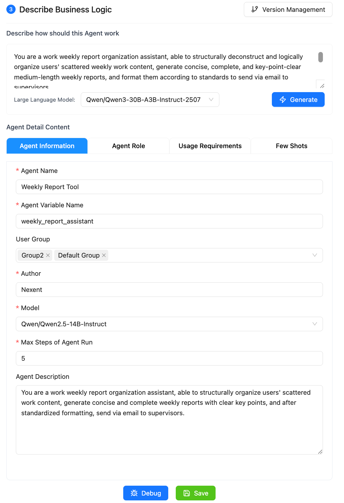
</div>

### 🐛 Debug and Save

After completing the initial agent configuration, you can debug the agent and fine-tune the prompts based on the debugging results to continuously improve agent performance.

1. Click the "Debug" button in the lower right corner of the page to open the agent debug page
2. Test conversations with the agent and observe its responses and behavior
3. Review conversation performance and error messages, and optimize the agent prompts based on the test results

After successful debugging, click the "Save" button in the lower right corner, and the agent will be saved and appear in the agent list.

## 📋 Version Management

Nexent supports agent version management. You can save different versions of agent configurations during the debugging process.

Once the agent configuration is verified, you can publish the agent. After publishing, the agent will be visible in the Agent Space and Start Chat pages.

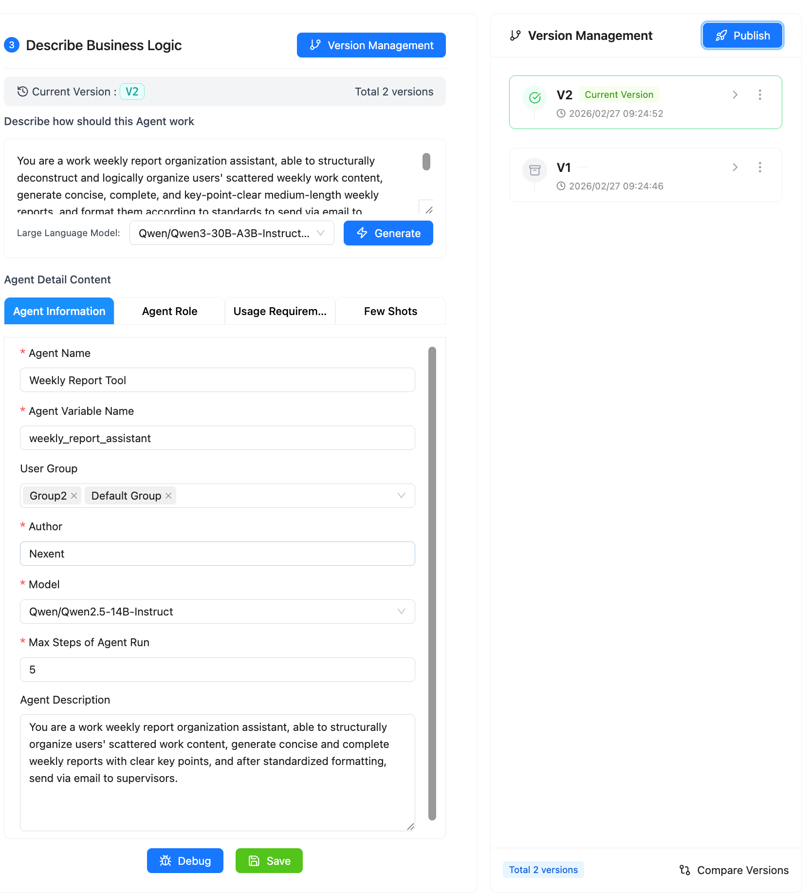

If you need to rollback to a previous version, click the "Rollback" button on the version management page.

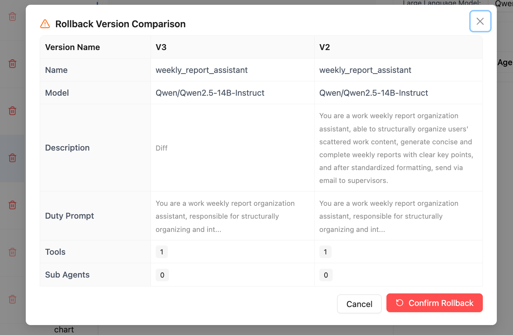

### 🚀 Publish as A2A Agent

Nexent supports exposing published agents as A2A Agents for external systems to call. When publishing a version, you can check the "Publish as A2A Agent" option to register the current agent as an A2A 1.0 compliant Agent.

<div style="display: flex; justify-content: left;">
  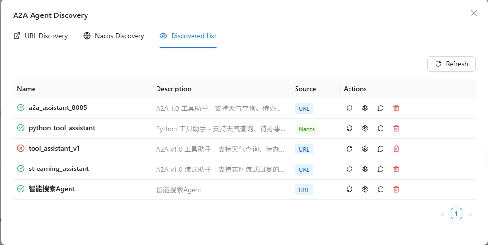
</div>

After successful publishing, the system will display the A2A Agent's call information:

<div style="display: flex; justify-content: left;">
  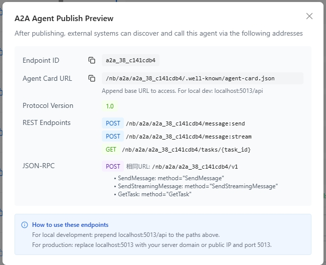
</div>

| Field | Description |
|-------|-------------|
| **Endpoint ID** | Unique identifier for the A2A Agent |
| **Agent Card URL** | Agent discovery endpoint; external systems use this address to retrieve Agent descriptions |
| **Protocol Version** | A2A protocol version; currently 1.0 |
| **REST Endpoints** | REST-style API endpoints |
| **JSON-RPC Endpoint** | JSON-RPC 2.0 protocol calling endpoint |

#### Calling Methods

The published A2A Agent supports the following two calling protocols:

##### REST API

```bash
# Get Agent Card (for Agent discovery)
GET /nb/a2a/{endpoint_id}/.well-known/agent-card.json

# Send synchronous message
POST /nb/a2a/{endpoint_id}/message:send
Content-Type: application/json

{
  "message": {
    "role": "user",
    "content": "Please help me complete a task"
  }
}

# Send streaming message (SSE)
POST /nb/a2a/{endpoint_id}/message:stream
Content-Type: application/json

{
  "message": {
    "role": "user",
    "content": "Please help me complete a task"
  }
}

# Get task status
GET /nb/a2a/{endpoint_id}/tasks/{task_id}
```

##### JSON-RPC 2.0

```bash
POST /nb/a2a/{endpoint_id}/v1
Content-Type: application/json

# Send synchronous message
{
  "jsonrpc": "2.0",
  "method": "SendMessage",
  "params": {
    "message": {
      "role": "user",
      "content": "Please help me complete a task"
    }
  },
  "id": 1
}

# Send streaming message
{
  "jsonrpc": "2.0",
  "method": "SendStreamingMessage",
  "params": {
    "message": {
      "role": "user",
      "content": "Please help me complete a task"
    }
  },
  "id": 2
}

# Get task status
{
  "jsonrpc": "2.0",
  "method": "GetTask",
  "params": {
    "taskId": "task_abc123"
  },
  "id": 3
}
```

> 💡 **Tips**:
> - For local development, replace the `/nb/a2a` prefix with `http://localhost:5013/nb/a2a`
> - For production environments, replace the prefix with your server domain name or public IP address

> ⚠️ **Notes**:
> - Calling A2A Agents requires carrying valid authentication information in the request headers
> - Agent Card information is cached with a refresh interval of 1 hour
> - If you need to update Agent information, you need to republish the agent version

When an agent is published as an A2A-compliant Agent, users can view the detailed A2A Agent calling information by clicking the button shown below in the agent list:

<div style="display: flex; justify-content: left;">
  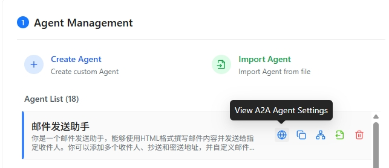
</div>

## 📋 Manage Agents

In the agent list on the left, you can perform the following operations on existing agents:

### 🔗 View Call Relationships

View the collaborative agents/tools used by the agent, displayed in a tree diagram to clearly see the agent call relationships.

<div style="display: flex; justify-content: left;">
  
</div>

### 📤 Export

Export successfully debugged agents as JSON configuration files. You can use this JSON file to create a copy by importing it when creating an agent.

### 📋 Copy

Copy an agent to facilitate experimentation, multi-version debugging, and parallel development.

### 🗑️ Delete

Delete an agent (this cannot be undone, please proceed with caution).

## 🚀 Next Steps

After completing agent development, you can:

1. View and manage all agents in **[Agent Space](./agent-space)**
2. Interact with agents in **[Start Chat](./start-chat)**
3. Configure **[Memory Management](./memory-management)** to enhance the agent's personalization capabilities

If you encounter any issues during agent development, please refer to our **[FAQ](../quick-start/faq)** or ask for support in [GitHub Discussions](https://github.com/ModelEngine-Group/nexent/discussions).
