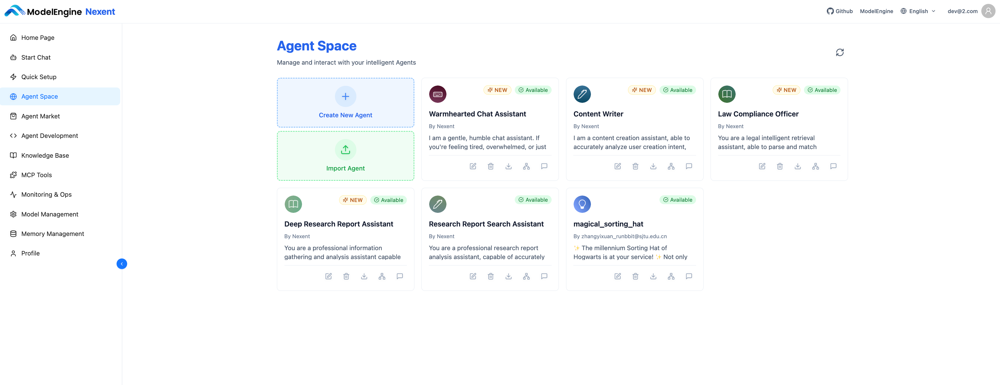

# Agent Space

Agent Space is the central dashboard for every agent you have built. View agents in card form, inspect their configurations, delete or export them, and jump straight into chats.

## 📦 Agent Cards

Each agent appears as a card showing:

- **Icon** – The agent’s avatar.
- **Name** – The display name.
- **Description** – A quick summary of what it does.
- **Status** – Whether the agent is available.
- **Actions** – Shortcuts for editing, exporting, deleting, and more.

## 🔧 Manage Agents

### View Agent Details

Click a card to open its details:

- **Basic info:** ID, name, description, status, max steps, and whether to provide run summary.
- **Model configuration:** Model name, business logic model, etc.
- **Prompts:** Role, constraints, examples, and the original description.
- **Tools:** Every tool the agent can use.
- **Sub-agents:** Any collaborative agents that are configured.

### Edit an Agent

1. Click **Edit** on the card.
2. You’ll be taken to the Agent Development page.
3. Adjust the settings and save—updates sync back to Agent Space automatically.

### Delete an Agent

1. Click **Delete** on the card.
2. Confirm the deletion (this cannot be undone).

> ⚠️ **Note:** Deleting an agent permanently removes it. Export a backup first if you might need it later.

### Export an Agent

1. Click **Export** on the card.
2. Nexent downloads a JSON configuration file you can import later.

### Copy an Agent

1. Click **Copy** on the card to duplicate the agent.
2. This facilitates experimentation, multi-version debugging, and parallel development.

### View Relationships

1. Click **View Relationships** to see how the agent interacts with tools and other agents.

### Jump to Chat

1. Click **Chat** to open Start Chat with the agent already selected.

## 🚀 Next Steps

Once you finish reviewing agents you can:

1. Talk to them in **[Start Chat](./start-chat)**.
2. Continue iterating in **[Agent Development](./agent-development)**.
3. Enhance retention with **[Memory Management](./memory-management)**.

Need help? Check the **[FAQ](../quick-start/faq)** or open a thread in [GitHub Discussions](https://github.com/ModelEngine-Group/nexent/discussions).
