# 智能体开发

在智能体开发页面中，您可以创建、配置和管理智能体。智能体是 Nexent 的核心功能，它们能够理解您的需求并执行相应的任务。

## 🔧 创建智能体

在智能体管理页签下，点击"创建 Agent"即可创建一个空白智能体，点击"退出创建"即可退出创建模式。
如果您有现成的智能体配置，也可以导入使用：

1. 点击"导入 Agent"
2. 在弹出的文件选择对话框中选择智能体配置文件（JSON 格式）
3. 点击"打开"按钮，系统会验证配置文件的格式和内容，并显示导入的智能体信息

<div style="display: flex; justify-content: left;">
  
</div>

> ⚠️ **提示**：如果导入了重名的智能体，系统会弹出提示弹窗。您可以选择：
> - **直接导入**：保留重复名称，导入后的智能体会处于不可用状态，需手动修改智能体名称和变量名后才能使用
> - **重新生成并导入**：系统将调用 LLM 对智能体进行重命名，会消耗一定的模型 token 数，可能耗时较长

> 📌 **重要说明**：通过导入创建的智能体，如果其工具中包含 `knowledge_base_search` 等知识库检索工具，这些工具只会检索**当前登录用户在本环境中有权限访问的知识库**。导入文件中原有的知识库配置不会自动继承，因此实际检索结果和回答效果，可能与智能体原作者环境下的表现存在差异。

<div style="display: flex; justify-content: left;">
  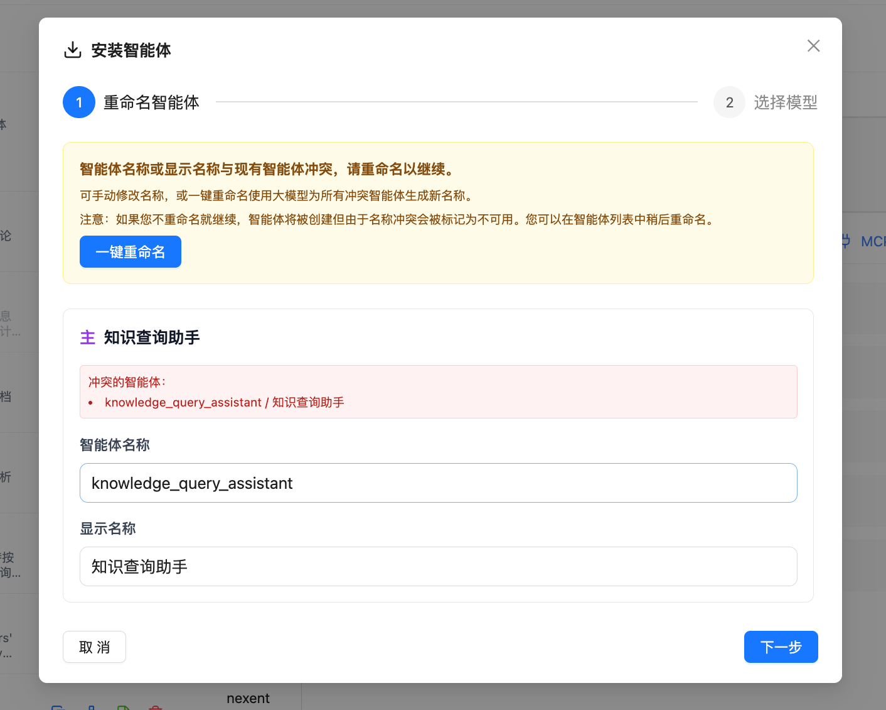
</div>

## 👥 配置协作智能体/工具

您可以为创建的智能体配置其他协作智能体，也可以为它配置可使用的工具，以赋予智能体能力完成复杂任务。

### 🤝 协作 Agent

协作智能体用于帮助当前智能体完成复杂任务。协作智能体的来源分为两类：

- **内部 Agent**：平台已发布的智能体
- **外部 A2A Agent**：通过 A2A 协议发现的第三方 Agent

1. 点击"协作 Agent"页签下的加号，弹出可选择的智能体列表
2. 智能体列表分为"内部 Agent"和"外部 A2A Agent"两个页签，您可以根据需要选择
3. 在下拉列表中选择要添加的智能体
4. 允许选择多个协作智能体
5. 可点击 × 取消选择此智能体

<div style="display: flex; justify-content: left;">
  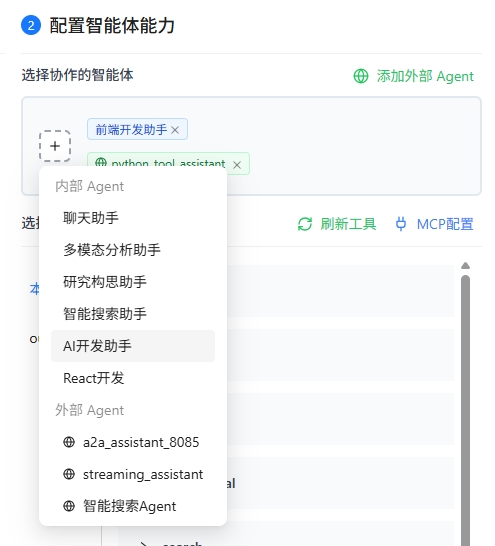
</div>

#### 🌐 添加外部 A2A Agent

Nexent 支持通过 A2A 协议与第三方 Agent 进行通信。您可以通过以下两种方式发现外部 A2A Agent：

##### 通过 URL 发现 Agent

如果您知道目标 Agent 的 Agent Card 地址，可以使用 URL 发现方式：

<div style="display: flex; justify-content: left;">
  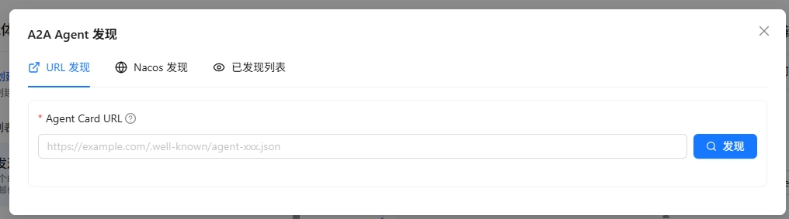
</div>

1. 在外部 A2A Agent 列表中，点击"添加外部 Agent"按钮
2. 选择"URL 发现"页签
3. 填写 Agent Card URL 地址，例如：`https://example.com/.well-known/agent.json`
4. 点击"发现"按钮，系统会自动获取 Agent 的相关信息
5. 发现成功后，可以查看 Agent 的名称、描述、能力等信息
6. 点击"添加到列表"完成添加

> 💡 **提示**：Agent Card 是符合 A2A 1.0 规范的 Agent 描述文件，包含了 Agent 的名称、描述、调用地址、能力等信息。

##### 通过 Nacos 发现 Agent

如果您的 Agent 注册在 Nacos 服务发现平台，可以使用 Nacos 发现方式：

<div style="display: flex; justify-content: left;">
  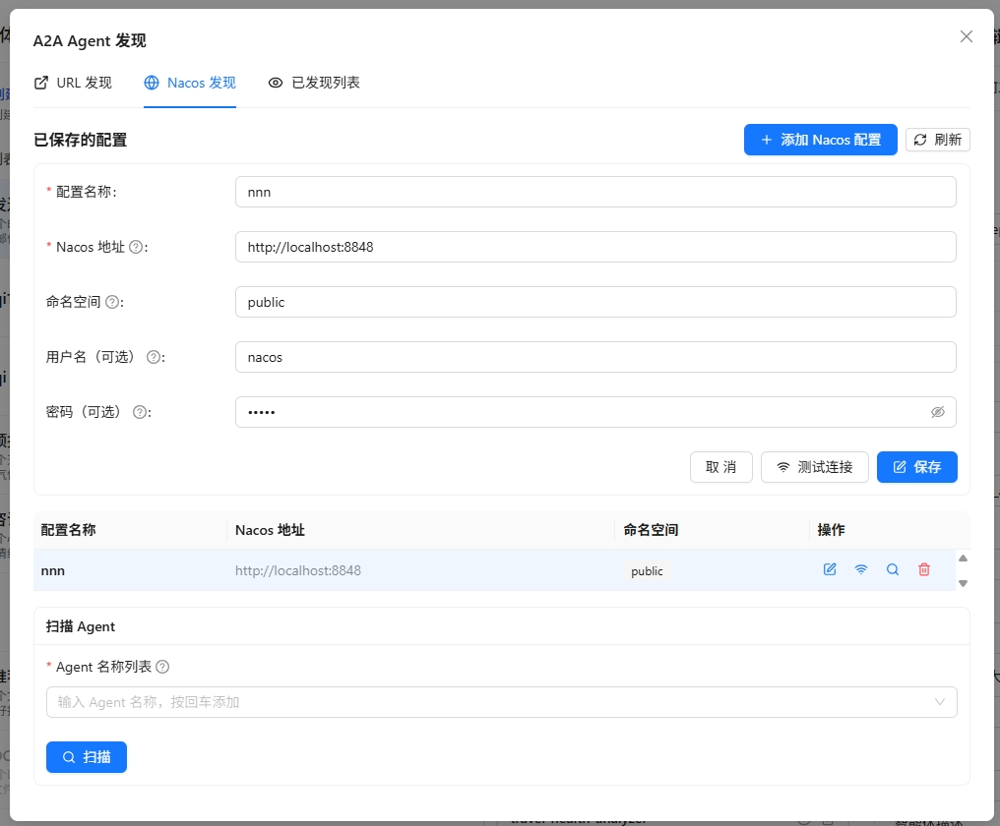
</div>

1. 在外部 A2A Agent 列表中，点击"添加外部 Agent"按钮
2. 选择"Nacos 发现"页签
3. 首次使用时，需要先配置 Nacos 连接信息：
   - **Nacos 服务器地址**：填写 Nacos 服务器地址，如 `http://127.0.0.1:8848`
   - **命名空间 ID**：填写 Nacos 命名空间 ID（可选）
   - **分组名**：填写服务分组名，默认为 `DEFAULT_GROUP`
   - **用户名/密码**：填写 Nacos 访问凭证（可选）
4. 点击"保存配置"保存 Nacos 连接信息
5. 填写要扫描的 Agent 服务名称
6. 点击"扫描"按钮，系统会从 Nacos 中获取匹配的 Agent 信息
7. 扫描结果会列出所有匹配的 Agent，可以选择需要的 Agent 添加到列表

> ⚠️ **注意**：确保 Nacos 服务正常运行，且目标 Agent 已正确注册到 Nacos。

##### 管理已发现的外部 Agent

在外部 A2A Agent 列表中，您可以查看和管理所有已发现的外部 Agent：


<div style="display: flex; justify-content: left;">
  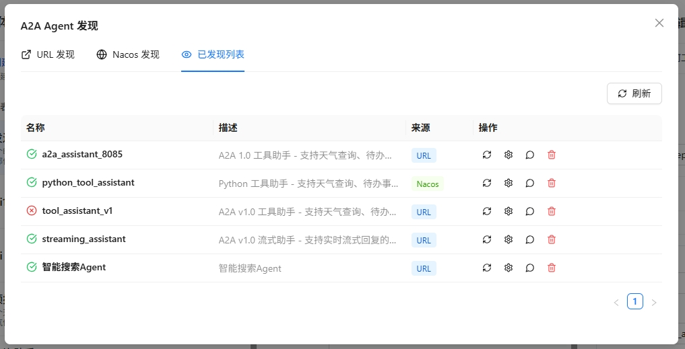
</div>

1. **查看 Agent 详情**：点击 Agent 卡片，可以查看其完整信息，包括名称、描述、URL、能力列表等
2. **测试 Agent**：点击"测试"按钮，可以向该 Agent 发送测试消息，验证其是否正常工作
3. **与 Agent 对话**：点击"对话"按钮，可以打开对话窗口，与该 Agent 进行实时交互
4. **配置调用协议**：点击"协议配置"按钮，可以选择该 Agent 的调用协议：
   - **HTTP + JSON**：使用 REST API 风格调用
   - **JSON-RPC**：使用 JSON-RPC 协议调用
5. **刷新 Agent 信息**：如果 Agent 信息发生变化，可以点击"刷新"按钮重新获取最新的 Agent Card
6. **移除 Agent**：点击"移除"按钮，可以将该 Agent 从已发现列表中删除

> 💡 **使用场景**：
> - 通过 URL 发现快速接入已知的第三方 Agent 服务
> - 通过 Nacos 发现批量接入同一服务注册中心的所有 Agent
> - 配置协议以兼容不同 Agent 服务提供商的要求

### 🛠️ 选择智能体的工具

智能体可以使用各种工具来完成任务，如知识库检索、文件解析、图片解析、收发邮件、文件管理等本地工具，也可接入第三方 MCP 工具，或自定义工具。

1. 在"选择智能体的工具"页签右侧，点击"刷新工具"来刷新可用工具列表
2. 选择想要添加工具所在的分组
3. 查看分组下可选用的所有工具，可点击 ⚙️ 查看工具描述，进行工具参数配置
4. 点击工具名即可选中该工具，再次点击可取消选择
   - 如果工具有必备参数没有配置，选择时会弹出弹窗引导进行参数配置
   - 如果所有必备参数已配置完成，选择则会直接选中

<div style="display: flex; justify-content: left;">
  
</div>

> 💡 **小贴士**：
> 1. 请选择 `knowledge_base_search` 工具，启用知识库的检索功能。
> 2. 请选择 `analyze_text_file` 工具，启用文档类、文本类文件的解析功能。
> 3. 请选择 `analyze_image` 工具，启用图片类文件的解析功能。
> 
> ⚠️ **向量化模型配置**：使用 `knowledge_base_search` 工具时，需要确保知识库已配置向量化模型。对于存量知识库，系统会提示选择向量化模型，请务必选择**创建该知识库时使用的向量化模型**。若选择的模型与知识库创建时使用的模型不一致，可能导致检索失败或结果不准确。
> 
> 📚 想了解系统已经内置的所有本地工具能力？请参阅 [本地工具概览](./local-tools/index.md)。
> 📚 想了解技能能力？请参阅 [技能管理](./skills.md)。

### 🔌 添加 MCP 工具

在"选择智能体的工具"页签右侧，点击"MCP 配置"，可在弹窗中进行 MCP 服务器的配置，查看已配置的 MCP 服务器

您可以通过以下两种方式在 Nexent 中添加 MCP 服务

**1️⃣ 通过 URL 添加 MCP 服务**

🔔 该方法适用于已有独立部署的 MCP 服务（支持 SSE 与 Streamble HTTP 协议）：

>1. 在界面上方的 **Add MCP Server** 区域填写 **Server name** 、 **Server URL** 
>
>⚠️ **注意**：服务器名称只能包含英文字母和数字，不能包含空格、下划线等其他字符
>
>2. 点击 右侧 **+ Add** 按钮，完成单个服务添加

**2️⃣ 通过 JSON 配置添加容器化 MCP 服务**

🔔 该方法适用于 npx 部署的容器化 MCP 服务

>1. 在 **Add Containerized MCP Service** 输入框中，填写符合示例格式的 JSON 配置
>
>```json
>{
> "mcpServers": {
>   "service-name": {
>     "args": [
>       "mcp-package-name@version",
>       "additional-parameters"
>     ],
>     "command": "npx"
>   }
> }
>}
>```
>
>2. 在下方 **Port** 输入框中，填写容器化服务对应的端口号
>3. 点击右侧 **+ Add** 按钮，完成容器化服务添加

<div style="display: flex; justify-content: left;">
  
</div>

有许多第三方服务如 [ModelScope](https://www.modelscope.cn/mcp) 提供了 MCP 服务，您可以快速接入使用。
您也可以自行开发 MCP 服务并接入 Nexent 使用，参考文档 [MCP 工具开发](../backend/tools/mcp)。

**3️⃣ 存量 API 转换为 MCP 服务**

🔔 该方法适用于将已有的 REST API 接口快速转换为 MCP 工具，无需额外开发即可让智能体调用现有 API 能力：

>1. 在 MCP 配置模块选择 **"API 转换为 MCP"** 接入类型
>
>2. 在下方的输入框中填写 API 基础信息：
>   - **服务名称**：MCP 服务的展示名称
>   - **OpenAPI JSON**：OpenAPI 3.x 规范的 JSON 内容
>   - **基础服务 URL**：API 服务的基础地址（支持 http/https）
>
>3. 点击右下角 **+ 添加** 按钮，完成对应 MCP 服务的转换

<div style="display: flex; justify-content: left;">
  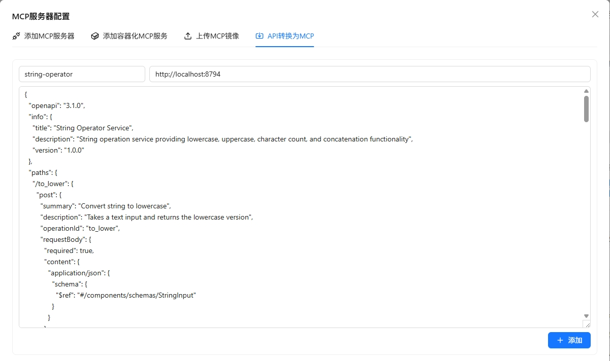
</div>

>
>4. 转换完成后，可在 **Outer APIs** 页签下查看所有外部 API 转换的 MCP 工具

<div style="display: flex; justify-content: left;">
  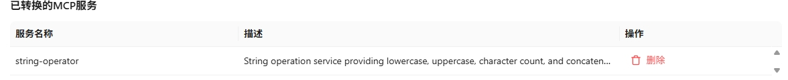
</div>

<div style="display: flex; justify-content: left;">
  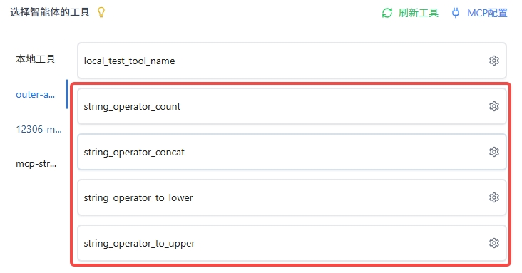
</div>

>💡 **使用场景**：
>- 快速接入企业内部的 REST API 接口
>- 将第三方服务的 HTTP API 转换为 MCP 工具
>- 无需编写 MCP Server 代码，直接通过 OpenAPI 规范生成工具


### ⚙️ 自定义工具

您可参考以下指导文档，开发自己的工具，并接入 Nexent 使用，丰富智能体能力。

- [LangChain 工具指南](../backend/tools/langchain)
- [MCP 工具开发](../backend/tools/mcp)
- [SDK 工具文档](../sdk/core/tools)

### 🧪 工具测试

无论是什么类型的工具（内置工具、外部接入的 MCP 工具，还是自定义开发工具），Nexent 都提供了"工具测试"能力。如果您在创建智能体时不确定某个工具的效果，可以使用测试功能来验证工具是否按预期工作。

1. 点击工具的小齿轮按钮 ⚙️，进入工具的详细配置弹窗
2. 首先确保已经配置了工具的必备参数（带红色星号的参数）
3. 在弹窗的左下角点击"工具测试"按钮
4. 右侧会新弹出一个测试框
5. 在测试框中输入测试工具的入参，例如：
   - 测试本地知识库检索工具 `knowledge_base_search` 时，需要输入：
     - 测试的 `query`，例如"维生素C的功效"
     - 检索的模式 `search_mode`（默认为 `hybrid`）
     - 目标检索的知识库列表 `index_names`，如 `["医疗", "维生素知识大全"]`
   - 若不输入 `index_names`，则默认检索知识库页面所选中的全部知识库
      - 是否启用重排模型（默认为 `false`），启用后配置重排模型，实现对检索结果的重排优化 
6. 输入完成后点击"执行测试"开始测试，并在下方查看测试结果

<div style="display: flex; justify-content: left;">
  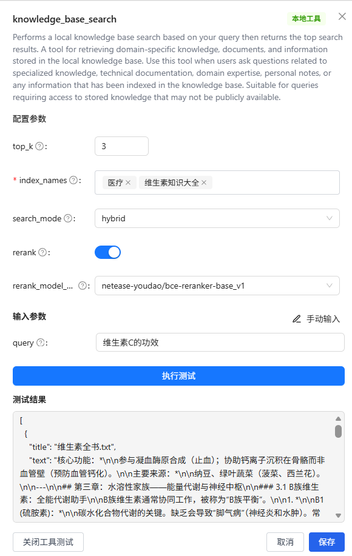
</div>

## 📝 描述业务逻辑

### ✍️ 描述智能体应该如何工作

根据选择的协作智能体和工具，您现在可以用简洁的语言来描述，您希望这个智能体应该如何工作。Nexent 会根据您的描述，自动为您生成智能体配置以及提示词等信息。

1. 在"描述智能体应该如何工作"下的编辑框中，输入简洁描述，如"你是一个专业的知识问答小助手，具备本地知识检索和联网检索能力，综合信息以回答用户问题"
2. 选择模型（生成提示词时选择更聪明的模型以优化回复逻辑），点击"生成智能体"按钮，Nexent 会为您生成智能体详细内容，包括基础信息以及提示词（角色、使用要求、示例）
3. 您可在下方智能体详细内容中，针对自动生成的内容（包括基础信息和提示词）进行编辑微调

#### 📋 智能体基础信息配置

在基础信息区域，若您对自动生成的内容不满意，您可以手工修改以下各项：

| 配置项 | 说明 |
|--------|------|
| **智能体名称** | 智能体的展示名称，用于界面显示和用户识别。 |
| **智能体变量名** | 智能体的内部标识名称，用于代码中引用该智能体。只能包含字母、数字和下划线，且必须以字母或下划线开头。 |
| **作者** | 智能体的创建者名称，默认值为当前登录用户的邮箱。 |
| **用户组** | 智能体所属的用户组，用于权限管理和组织管理。若为空，则表示无所属用户组。 |
| **组内权限** | 控制同组用户对该智能体的访问权限：<br>- **同组可编辑**：同组用户可以查看和编辑该智能体<br>- **同组只读**：同组用户只能查看，不能编辑<br>- **私有**：只有创建者和管理员可以访问 |
| **大语言模型** | 智能体运行时使用的大语言模型，用于处理推理和生成回复。 |
| **智能体运行最大步骤数** | 智能体在单次对话中最多可以执行的思考-行动循环次数。步数越多，智能体可以处理更复杂的任务，但也会消耗更多资源。 |
| **提供运行摘要** | 控制智能体在被用作子智能体时，是否向主智能体提供运行细节：<br>- **开启（默认）**：当此智能体被用作子智能体时，会向主智能体提供详细的运行过程摘要<br>- **关闭**：当此智能体被用作子智能体时，只返回最终结果，不提供详细的运行过程 |
| **智能体描述** | 智能体的功能描述，用于说明智能体的用途和能力。 |

> 💡 **使用建议**：
> - 智能体变量名应使用有意义的英文命名，如 `code_assistant`、`data_analyst` 等
> - 智能体运行最大步骤数建议根据任务复杂度设置，简单的问答任务可设为 3-5 步，复杂的推理任务可设为 10-20 步
> - 如果子智能体的运行过程对主智能体的决策有参考价值，建议开启"提供运行摘要"选项。如果只需要子智能体的最终结果以减少上下文消耗，建议关闭此选项

<div style="display: flex; justify-content: left;">
  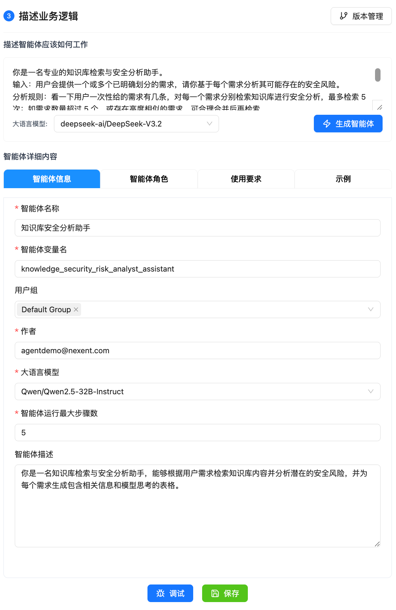
</div>

## 🐛 调试与保存


在完成初步智能体配置后，您可以对智能体进行调试，根据调试结果微调提示词，持续提升智能体表现。

1. 在页面右下角点击"调试"按钮，弹出智能体调试页面
2. 与智能体进行测试对话，观察智能体的响应和行为
3. 查看对话表现和错误信息，根据测试结果优化智能体提示词

调试成功后，可点击右下角"保存"按钮，此智能体将会被保存并出现在智能体列表中。

## 🐛 版本管理

Nexent 支持智能体的版本管理，您可以在调试过程中，保存不同版本的智能体配置。

确认智能体配置无误后，您可发布智能体。发布后智能体将在智能体空间、开始问答中可见。

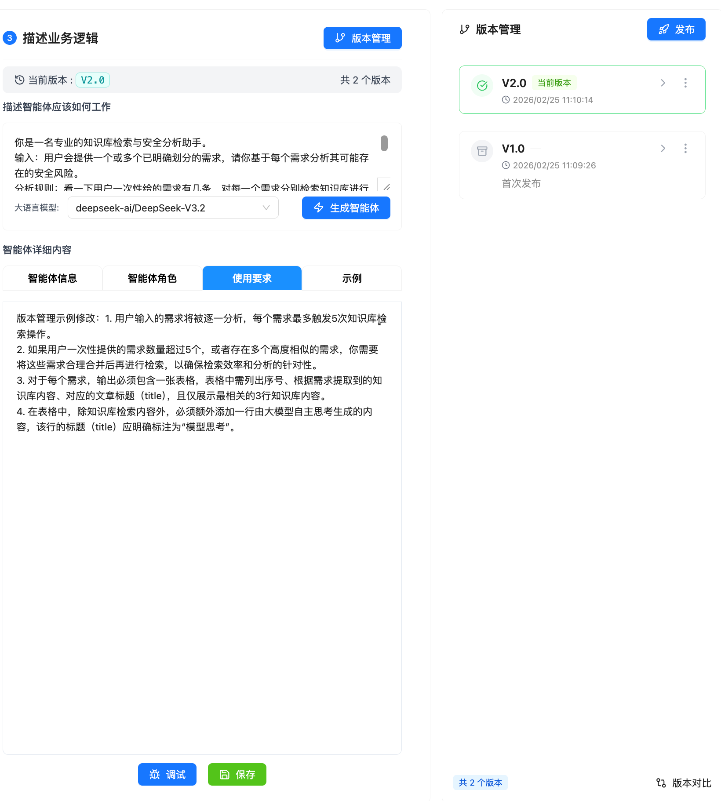

若需回滚到其他版本，可在版本管理页面点击"回滚"按钮。

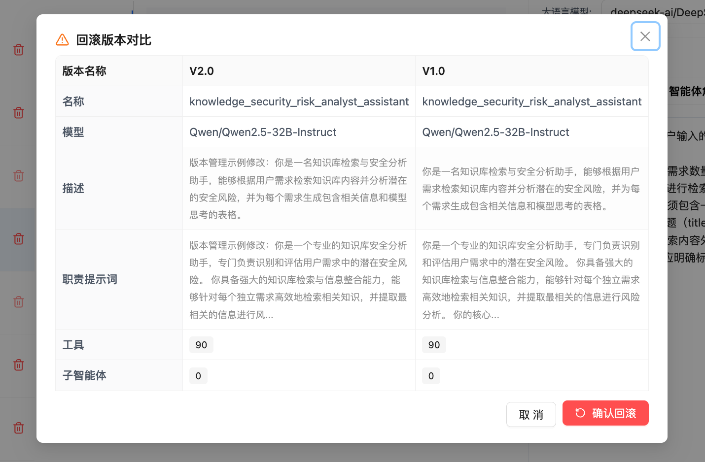

### 🚀 发布为 A2A Agent

Nexent 支持将已发布的智能体作为 A2A Agent 暴露给外部系统调用。在发布版本时，您可以勾选"发布为 A2A Agent"选项，将当前智能体注册为符合 A2A 1.0 规范的 Agent。

<div style="display: flex; justify-content: left;">
  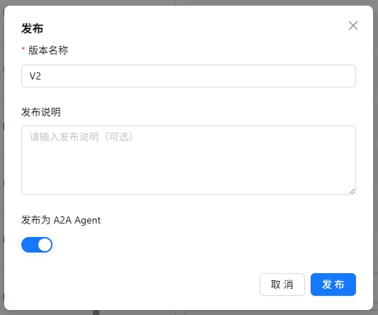
</div>

发布成功后，系统会显示 A2A Agent 的调用信息，包括：

<div style="display: flex; justify-content: left;">
  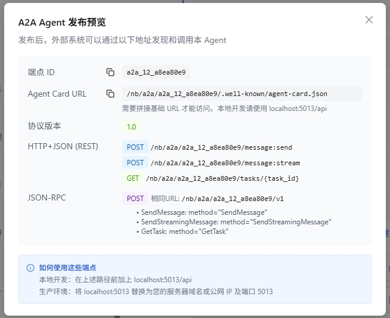
</div>

| 信息项 | 说明 |
|--------|------|
| **Endpoint ID** | A2A Agent 的唯一标识符 |
| **Agent Card URL** | Agent 发现端点，外部系统通过此地址获取 Agent 描述 |
| **协议版本** | A2A 协议版本，当前为 1.0 |
| **REST 端点** | 基于 REST 风格的 API 端点 |
| **JSON-RPC 端点** | 基于 JSON-RPC 2.0 协议的调用端点 |

#### 调用方式

发布后的 A2A Agent 支持以下两种调用协议：

##### REST API

```bash
# 获取 Agent Card（用于 Agent 发现）
GET /nb/a2a/{endpoint_id}/.well-known/agent-card.json

# 发送同步消息
POST /nb/a2a/{endpoint_id}/message:send
Content-Type: application/json

{
  "message": {
    "role": "user",
    "content": "请帮我完成某个任务"
  }
}

# 发送流式消息（SSE）
POST /nb/a2a/{endpoint_id}/message:stream
Content-Type: application/json

{
  "message": {
    "role": "user",
    "content": "请帮我完成某个任务"
  }
}

# 获取任务状态
GET /nb/a2a/{endpoint_id}/tasks/{task_id}
```

##### JSON-RPC 2.0

```bash
POST /nb/a2a/{endpoint_id}/v1
Content-Type: application/json

# 发送同步消息
{
  "jsonrpc": "2.0",
  "method": "SendMessage",
  "params": {
    "message": {
      "role": "user",
      "content": "请帮我完成某个任务"
    }
  },
  "id": 1
}

# 发送流式消息
{
  "jsonrpc": "2.0",
  "method": "SendStreamingMessage",
  "params": {
    "message": {
      "role": "user",
      "content": "请帮我完成某个任务"
    }
  },
  "id": 2
}

# 获取任务状态
{
  "jsonrpc": "2.0",
  "method": "GetTask",
  "params": {
    "taskId": "task_abc123"
  },
  "id": 3
}
```

> 💡 **提示**：
> - 本地开发时，请将路径前面的 `/nb/a2a` 部分替换为 `http://localhost:5013/nb/a2a`
> - 生产环境请将路径替换为您的服务器域名或公网 IP 地址

> ⚠️ **注意事项**：
> - 调用 A2A Agent 需要在请求头中携带有效的认证信息
> - Agent Card 信息会被缓存，刷新间隔为 1 小时
> - 如需更新 Agent 信息，需要重新发布智能体版本

当发布的Agent为符合A2A协议的Agent时，在智能体列表中，用户可以在智能体列表中点击下面这个按钮查看A2A Agent调用具体信息：

<div style="display: flex; justify-content: left;">
  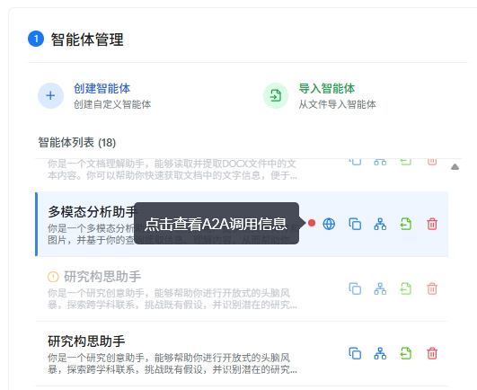
</div>

## 🔧 管理智能体

在左侧智能体列表中，您可对已有的智能体进行以下操作：

### 🔗 查看调用关系

查看智能体所使用的协作智能体/工具，以树状图形式明晰查看智能体调用关系。

<div style="display: flex; justify-content: left;">
  
</div>

### 📤 导出

可将调试成功的智能体导出为 JSON 配置文件，在创建智能体时可以使用此 JSON 文件以导入的方式创建副本。


### 📋 复制

复制 Agent，便于智能体的实验、多版本调试与并行开发。

### 🗑️ 删除

删除智能体（不可撤销，请谨慎操作）。

## 🚀 下一步

完成智能体开发后，您可以：

1. 在 **[智能体空间](./agent-space)** 中查看和管理所有智能体
2. 在 **[开始问答](./start-chat)** 中与智能体进行交互
3. 在 **[记忆管理](./memory-management)** 配置记忆以提升智能体的个性化能力

如果您在使用程中遇到任何问题，请参考我们的 **[常见问题](../quick-start/faq)** 或在 [GitHub Discussions](https://github.com/ModelEngine-Group/nexent/discussions) 中进行提问获取支持。
