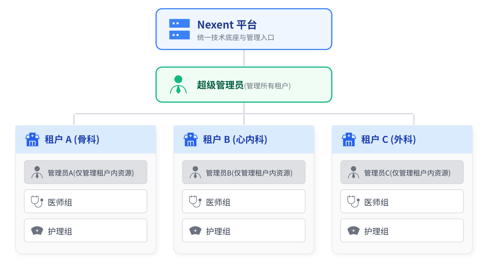
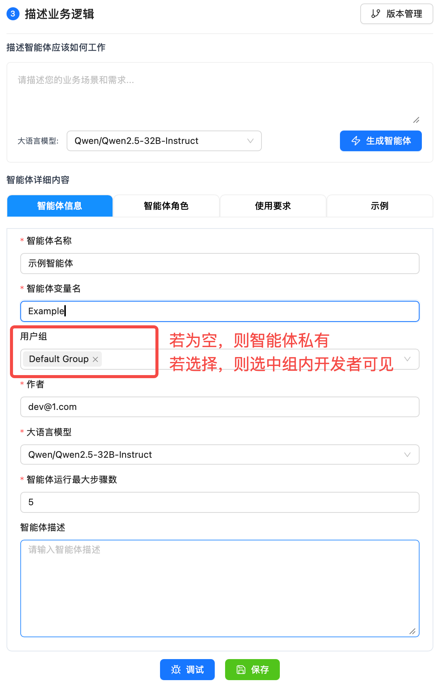
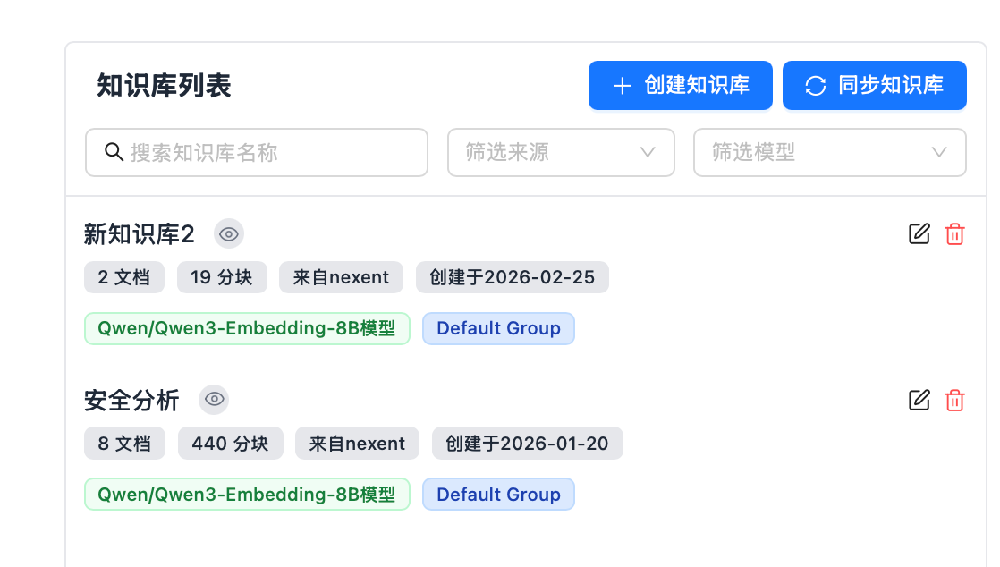
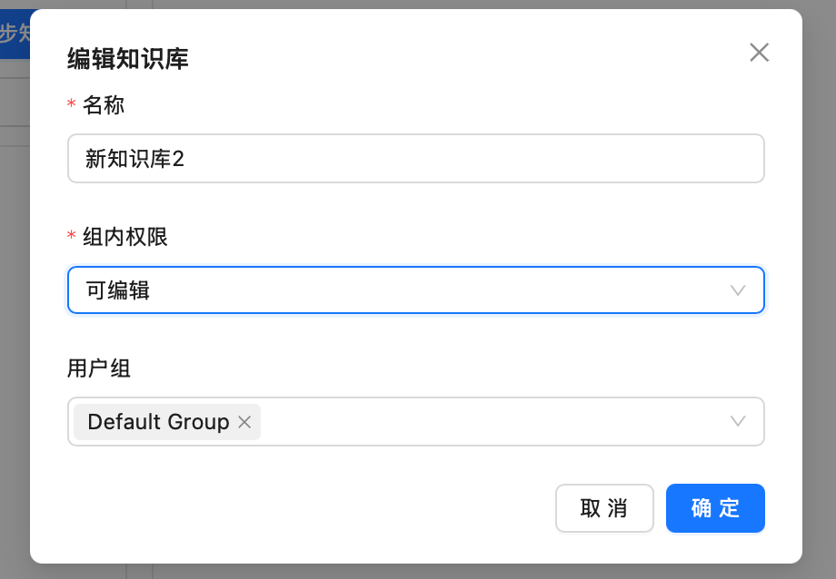
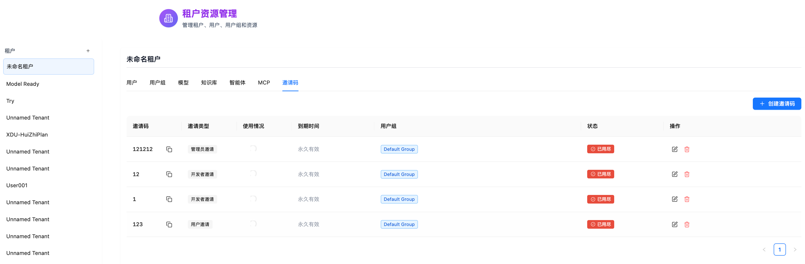
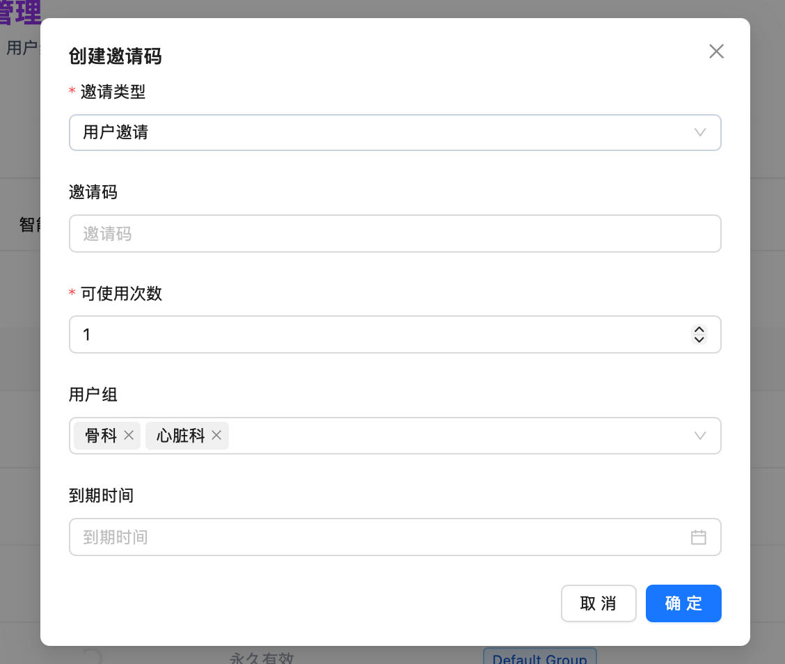

# 用户管理

本页面详细说明 Nexent 平台的用户角色体系、数据可见性范围、各类资源的操作权限，并分享权限配置的实践案例。

⚠️ **重要提示**：首次部署 v1.8.0 及以上版本时，需特别留意 Docker 日志中输出的 `suadmin` 超级管理员账号信息。该账号为系统最高权限账户，密码仅在首次生成时显示，后续无法再次查看，请务必妥善保存。

## 📋 页面导航

- [一、角色体系](#一角色体系) - 四种核心角色的定义与职责
- [二、页签访问权限](#二页签访问权限) - 各角色可访问的系统页面
- [三、资源权限对照表](#三资源权限对照表) - 详细的各种资源操作权限
- [四、权限配置](#四权限配置) - 智能体与知识库的权限管理
- [五、邀请码机制](#五邀请码机制) - 用户注册与邀请流程
- [六、实践案例](#六实践案例) - 权限配置的建议

## 一、角色体系

Nexent 采用基于角色的访问控制（RBAC）模型，通过租户与用户组的概念划分用户范围：

### 1.1 什么是租户？

- **租户**是 Nexent 平台中最上层的资源隔离单位，可以理解为一个独立的工作空间或组织单元

- 不同租户之间，数据完全隔离、互不可见，每个租户内可独立创建智能体、知识库、模型、MCP等

- 仅超级管理员可跨租户权限管理，邀请租户管理员

### 1.2 什么是用户组？

- **用户组**是某租户内的用户集合，可通过用户组划分来实现对用户的管理和权限控制
- 一个用户也可以属于多个用户组
- 租户内的知识库、智能体等资源可见性，通过用户组控制

### 1.3 用户角色

包含以下四个核心角色：

| 角色           | 职责描述                                       | 适用场景             | 角色备注                                                     |
| -------------- | ---------------------------------------------- | -------------------- | ------------------------------------------------------------ |
| **超级管理员** | 可创建**不同租户**，管理所有租户资源           | 平台运维人员         | Nexent系统只有一个超级管理员，于本地部署时生成账号密码，请务必留存，日志关闭后无法找回 |
| **管理员**     | 负责**租户内**的资源管理和权限分配             | 部门经理、租户负责人 | 同一租户可拥有多个管理员，只能由超级管理员邀请               |
| **开发者**     | 可创建和编辑智能体、知识库等资源，但无管理权限 | 开发人员、产品经理   | 同一租户下可拥有多个开发者，可属于租户下多个用户组，由管理员和超级管理员邀请 |
| **普通用户**   | 仅可使用平台提供的各项功能，无创建和编辑权限   | 员工、业务人员       | 同一租户下可拥有多个普通用户，可属于租户下多个用户组，由管理员和超级管理员邀请 |

#### 1.3.1 超级管理员

超级管理员负责平台的整体运维，可以创建租户并参与各租户内的用户权限管理，但无法使用智能体

- ✅ 可以管理所有租户的人员及权限
- ✅ 可以查看全平台监控与运维数据
- ❌ 不能直接查看具体业务数据（如智能体对话内容、知识库文档等）
- ❌ 不能创建和使用智能体、知识库等

#### 1.3.2 管理员

管理员是租户内的最高权限角色，负责租户内的资源管理和用户管理，拥有平台全部功能

- ✅ 可以管理租户内的所有用户与用户组
- ✅ 可以查看并编辑租户内所有智能体、知识库、MCP
- ❌ 不能访问其他租户的数据

#### 1.3.3 开发者

开发者是租户内的技术角色，负责创建和优化智能体、知识库等技术资源

- ✅ 可以创建智能体和知识库，并设置权限
- ⚠️ 对他人创建的资源，需要被授权才能编辑
- ❌ 不能管理租户内的用户和用户组

#### 1.3.4 普通用户

普通用户仅有使用智能体进行对话的权限

- ✅ 可以使用被授权的智能体进行对话
- ✅ 可以查看自己的使用记录和个人信息
- ❌ 不能创建或编辑智能体、知识库

## 二、页签访问权限

| 页签           | 超级管理员 | 管理员 | 开发者 | 普通用户 |
| -------------- | :--------: | :----: | :----: | :------: |
| **首页**       |     ✅      |   ✅    |   ✅    |    ✅     |
| **开始问答**   |     ❌      |   ✅    |   ✅    |    ✅     |
| **快速配置**   |     ❌      |   ✅    |   ✅    |    ✅     |
| **智能体空间** |     ❌      |   ✅    |   ✅    |    ❌     |
| **智能体市场** |     ❌      |   ✅    |   ✅    |    ❌     |
| **智能体开发** |     ❌      |   ✅    |   ✅    |    ❌     |
| **知识库**     |     ❌      |   ✅    |   ✅    |    ❌     |
| **MCP工具**    |     ❌      |   ✅    |   ✅    |    ❌     |
| **监控与运维** |     ✅      |   ✅    |   ✅    |    ❌     |
| **模型管理**   |     ❌      |   ✅    |   ✅    |    ❌     |
| **记忆管理**   |     ❌      |   ✅    |   ✅    |    ✅     |
| **个人信息**   |     ❌      |   ✅    |   ✅    |    ✅     |
| **租户资源**   |     ✅      |   ✅    |   ❌    |    ❌     |

## 三、资源权限对照表

以下表格展示了四种角色对各类资源的操作权限。其中：

- **超级管理员**：可管理所有租户的资源（跨租户）
- **管理员/开发者/普通用户**：仅可操作本租户内的资源

### 3.1 用户与用户组权限

| 操作               | 超级管理员 | 管理员 | 开发者 | 普通用户 |
| ------------------ | :--------: | :----: | :----: | :------: |
| **查看租户列表**   |     ✅      |   ❌    |   ❌    |    ❌     |
| **创建/删除租户**  |     ✅      |   ❌    |   ❌    |    ❌     |
| **查看用户列表**   |     ✅      |   ✅    |   ❌    |    ❌     |
| **编辑用户权限**   |     ✅      |   ✅    |   ❌    |    ❌     |
| **删除用户**       |     ✅      |   ✅    |   ❌    |    ❌     |
| **分配用户组**     |     ✅      |   ✅    |   ❌    |    ❌     |
| **查看用户组列表** |     ✅      |   ✅    |   ❌    |    ❌     |
| **创建用户组**     |     ✅      |   ✅    |   ❌    |    ❌     |
| **编辑用户组**     |     ✅      |   ✅    |   ❌    |    ❌     |
| **删除用户组**     |     ✅      |   ✅    |   ❌    |    ❌     |

### 3.2 模型权限

| 操作             | 超级管理员 | 管理员 | 开发者 | 普通用户 |
| ---------------- | :--------: | :----: | :----: | :------: |
| **查看模型列表** |     ✅      |   ✅    |   ✅    |    ❌     |
| **添加模型**     |     ✅      |   ✅    |   ❌    |    ❌     |
| **编辑模型**     |     ✅      |   ✅    |   ❌    |    ❌     |
| **删除模型**     |     ✅      |   ✅    |   ❌    |    ❌     |
| **测试连通性**   |     ✅      |   ✅    |   ✅    |    ❌     |
| **使用模型**     |     ❌      |   ✅    |   ✅    |    ✅     |

> 💡 **说明**：模型为租户级共享资源，同租户内所有用户组共享相同的模型池，不存在组间隔离。管理员统一管理模型配置，开发者和普通用户仅能使用已配置的模型。

### 3.3 知识库权限

| 操作                     | 超级管理员 | 管理员 |      开发者       | 普通用户 |
| ------------------------ | :--------: | :----: | :---------------: | :------: |
| **查看知识库列表**       |     ✅      |   ✅    | 🟡 自己创建/被授权 |    ❌     |
| **查看知识库详情**       |     ❌      |   ✅    | 🟡 自己创建/被授权 |    ❌     |
| **查看知识库总结**       |     ✅      |   ✅    | 🟡 自己创建/被授权 |    ❌     |
| **创建知识库**           |     ❌      |   ✅    |         ✅         |    ❌     |
| **编辑知识库名称和权限** |     ✅      |   ✅    | 🟡 自己创建/被授权 |    ❌     |
| **编辑知识库分块、总结** |     ❌     |   ✅    | 🟡 自己创建/被授权 |    ❌     |
| **删除知识库**           |     ✅      |   ✅    | 🟡 自己创建/被授权 |    ❌     |
| **上传/删除文件**        |     ❌      |   ✅    | 🟡 自己创建/被授权 |    ❌     |

### 3.4 智能体权限

| 操作               | 超级管理员 | 管理员 |      开发者       |        普通用户        |
| ------------------ | :--------: | :----: | :---------------: | :--------------------: |
| **查看智能体列表** |     ✅      |   ✅    | 🟡 自己创建/被授权 | 🟡 被授权的已发布智能体 |
| **查看智能体信息** |     ✅      |   ✅    | 🟡 自己创建/被授权 |           ❌            |
| **编辑智能体配置** |     ❌      |   ✅    | 🟡 自己创建/被授权 |           ❌            |
| **管理智能体版本** |     ✅      |   ✅    | 🟡 自己创建/被授权 |           ❌            |
| **删除智能体**     |     ✅      |   ✅    | 🟡 自己创建/被授权 |           ❌            |
| **使用智能体对话** |     ❌      |   ✅    | 🟡 自己创建/被授权 | 🟡 被授权的已发布智能体 |

### 3.5 MCP权限

| 操作            | 超级管理员 | 管理员 | 开发者 | 普通用户 |
| --------------- | :--------: | :----: | :----: | :------: |
| **查看MCP工具** |     ✅      |   ✅    |   ✅    |    ❌     |
| **编辑MCP工具** |     ✅      |   ✅    |   ❌    |    ❌     |
| **添加MCP工具** |     ✅      |   ✅    |   ✅    |    ❌     |
| **删除MCP工具** |     ✅      |   ✅    |   ❌    |    ❌     |

> 💡 **说明**：MCP 工具为租户级共享资源，同租户内所有用户组共享相同的 MCP 工具，不存在组间隔离。管理员可添加和管理 MCP 工具，开发者仅能添加 MCP 工具。

## 四、权限配置

### 4.1 智能体权限设置

| 权限级别            | 说明                                                         | 适用场景         |
| ------------------- | ------------------------------------------------------------ | ---------------- |
| **仅创建者可见**    | 只有创建者（和管理员）可以查看和编辑                         | 个人开发的智能体 |
| **指定用户组-只读** | 智能体开发页面指定用户组，则用户组内开发者可见、可发布，但不可编辑、不可删除。 | 部门专用智能体   |

### 4.2 知识库权限设置

| 权限级别              | 说明                                 | 适用场景       |
| --------------------- | ------------------------------------ | -------------- |
| **私有**              | 只有创建者（和管理员）可以查看和管理 | 个人知识库     |
| **指定用户组-只读**   | 指定用户组可见，但不可编辑、删除     | 部门知识库     |
| **指定用户组-可编辑** | 指定用户组可见且可编辑、删除         | 项目团队知识库 |

  
  

## 五、邀请码机制

Nexent 平台采用邀请码机制控制新用户注册，确保平台的安全性和可控性。

### 5.1 生成邀请码

- 超级管理员可进入「租户资源」→「选择租户」→「邀请码」
- 管理员则直接通过「租户资源」→「邀请码」
- 点击「创建邀请码」
- 配置参数：邀请类型（管理员、开发者、用户）、邀请码、可使用次数、邀请进入的用户组、到期时间
- 复制邀请码分发给相关人员

## 六、实践案例

本节以**XX市人民医院-骨科**为例，展示如何在 Nexent 平台中构建单科室的医疗智能助手系统，以及各角色在系统中的工作流程。

### 6.1 整体架构设计

#### 6.1.1 架构层级对应关系

在XX市人民医院场景下，Nexent平台的层级与医院实体对应关系如下：

| 层级               | 对应实体                | 说明                                 |
| ------------------ | ----------------------- | ------------------------------------ |
| **超级管理员**     | 医院信息中心/系统管理员 | 管理整个医院的多个科室（多个租户）   |
| **单个租户**       | 单个科室                | 如：骨科、心内科、外科               |
| **租户内的用户组** | 科室内的专业小组        | 如：骨科医师组、护理组、康复组       |
| **用户组内的成员** | 具体医护人员/患者       | 如：骨科主任医师、责任护士、住院患者 |

#### 6.1.2 各角色的定义与职责

| 角色           | 在骨科租户中的对应人员           | 核心职责                                               | 数据可见范围                               |
| -------------- | -------------------------------- | ------------------------------------------------------ | ------------------------------------------ |
| **超级管理员** | 医院信息中心管理员               | 管理医院各科室的多个租户（骨科、心内科、外科等）       | 全院所有租户的数据                         |
| **管理员**     | 骨科主任                         | 管理骨科租户内的所有资源（用户、智能体、知识库等）     | 本科室（本租户）的所有数据                 |
| **开发者**     | 骨科各亚专业主任医师、副主任医师 | 创建和编辑临床辅助智能体、上传专业资料到知识库         | 本科室内被授权的资源，自己创建的资源可管理 |
| **普通用户**   | 住院医师、护士、患者             | 使用已发布的智能体进行工作辅助、查询信息、接受健康教育 | 本科室内被授权使用的资源，仅可使用不可编辑 |

### 6.2 示例用户工作场景

#### 场景1：医院信息中心管理员（超级管理员角色）

- **用户身份**：医院信息中心-系统管理员-张工
- **角色**：超级管理员
- **工作需求**：管理XX市人民医院所有科室的Nexent平台租户，确保各科室系统正常运行
- **在Nexent平台中的操作流程**：
  1. **登录系统**：使用超级管理员账号登录Nexent平台
  2. **查看租户列表**：进入「租户资源」页签，查看全院所有科室的租户：
     - 骨科租户
     - 心内科租户
     - 外科租户
     - 儿科租户
     - ...（其他科室租户）
  3. **创建新租户**（如医院新开设了康复科）：
     - 点击「创建租户」
     - 填写租户名称：「XX市人民医院-康复科」
     - 邀请康复科主任为租户管理员

#### 场景2：骨科主任（租户管理员角色）

- **用户身份**：骨科-管理层-骨科主任-刘主任
- **角色**：管理员
- **工作需求**：管理骨科租户内的所有资源，为新入职的脊柱外科医生创建账号并配置权限
- **在Nexent平台中的操作流程**：
  1. **登录系统**：使用管理员账号登录Nexent平台
  2. **进入用户管理**：点击「用户管理」页签
  3. **创建新用户**：
     - 点击「创建邀请码」，为该医生配置邀请进入的组以及开发者权限
  4. **分配用户组**：
     - 该医生还需进入后续新创建的「脊柱外科新组」用户组，进入「用户管理」编辑
  5. **检查智能体权限**：
     - 进入「智能体空间」，查看骨科现有的所有智能体
     - 检查「脊柱CT影像分析助手」的权限设置是否正确（对脊柱外科组可见、可编辑）
  6. **管理知识库**：
     - 进入「知识库」页签，查看骨科知识库的内容更新情况
     - 审批医生提交的新资料（如新的手术案例、研究文献等）

#### 场景3：脊柱外科主任医师（开发者角色）

- **用户身份**：骨科-脊柱外科组-主任医师-王医生
- **角色**：开发者
- **工作需求**：需要一个智能助手帮助分析脊柱CT影像，提供手术方案建议
- **在Nexent平台中的操作流程**：
  1. **登录系统**：使用医院分配的邀请码注册账号密码登录并进入对应的开发组
  2. **进入智能体开发**：点击「智能体开发」页签
  3. **创建新智能体**：点击「创建智能体」，命名为「脊柱CT影像分析助手」
  4. **配置智能体能力**：
     - 选择「医学影像分析模型」作为基础模型
     - 关联「脊柱外科知识库」作为知识来源
     - 配置提示词，训练智能体识别椎间盘突出、脊柱侧弯等病变
  5. **设置权限**：
     - 可见用户组：选择「脊柱外科组」
     - 权限级别：选择「可编辑」（允许同科室医生修改优化）
  6. **发布智能体**：点击「发布」，智能体正式投入使用
- **可访问的数据**：
  - ✅ 自己创建的「脊柱CT影像分析助手」智能体（可编辑、可管理版本）
  - ✅ 被授权使用的其他智能体（如「骨科用药助手」）（仅可使用）
  - ✅ 骨科相关的知识库（可查询，部分可上传资料）
  - ❌ 其他租户（如心内科）的数据（完全隔离）

#### 场景4：骨科住院患者（普通用户角色）

- **用户身份**：骨科-住院患者组-住院患者-张先生
- **角色**：普通用户
- **工作需求**：腰椎间盘术后，想了解康复训练方法和出院后注意事项
- **在Nexent平台中的操作流程**：
  1. **登录系统**：登录Nexent平台患者端
  2. **进入患者服务**：点击「开始问答」页签
  3. **选择智能体**：点击「骨科康复助手」
  4. **发起咨询**：
     - 输入问题：「腰椎间盘术后第3天，可以做哪些康复训练？」
     - 智能体根据骨科康复知识库，提供适合术后早期的康复动作视频和指导
  5. **预约随访**：通过智能体预约出院后1个月的门诊随访
- **可访问的数据**：
  - ✅ 「骨科康复助手」智能体（仅可使用）
  - ❌ 医生的诊断系统（无权限）
  - ❌ 其他患者的数据（完全隔离）

### 获取帮助

如果您在使用过程中遇到任何问题：

- 📖 查看 **[常见问题](../quick-start/faq)** 获取详细解答
- 💬 加入我们的 [Discord 社区](https://discord.gg/tb5H3S3wyv) 与其他用户交流
- 🆘 联系技术支持获取专业帮助